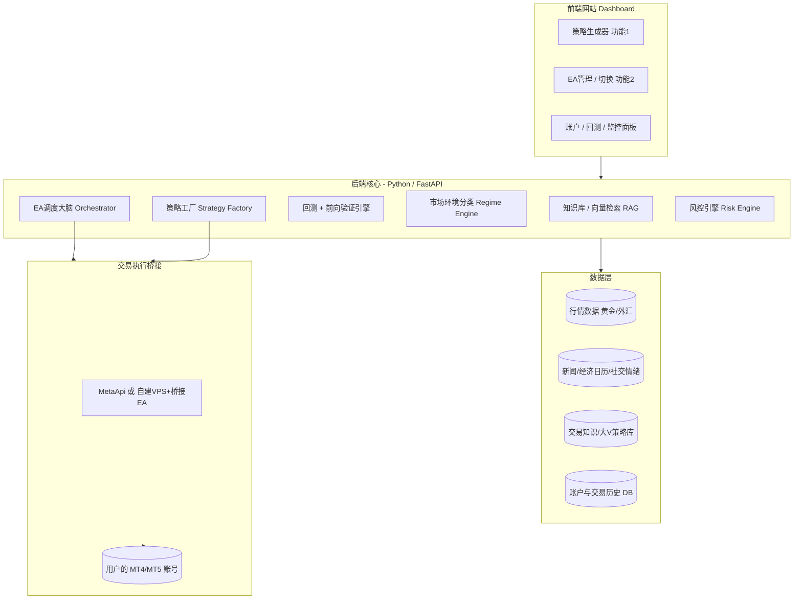
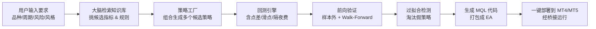
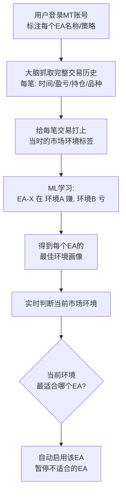

# DATA BRAIN —— AI/ML 交易大脑 设计文档

> 目标：把"全部交易员 / EA 自动交易系统"接入一个统一的 AI + Machine Learning 平台，
> 用于**信息处理、策略生成、风险管理与 EA 调度**，帮助交易员提升交易表现。
>
> 本文档给出一套**清晰、可落地、不夸大**的实现逻辑，作为开发蓝图。

---

## 0. 一个最重要的现实校正（先读）

**MT4/MT5 没有"在网页里直接登录 broker 并跑系统"的官方能力。**
MT4/MT5 是桌面 / 服务器端终端。要在网站里控制它们，业界真实可行的方式只有两种：

1. **MetaApi（推荐起步）**：第三方云服务，把 MT4/MT5 账号封装成 REST / WebSocket API，
   可读行情、读账户与历史、下单、启停 EA。接入快、运维省。
2. **自建 VPS + MT 终端 + 桥接 EA**：在云服务器上运行 MT5 终端，内置一个
   用 socket / ZeroMQ / REST 通信的桥接 EA。更可控，但工程量与运维成本高。

> 结论：**网站是"指挥中心"，真正执行交易的仍是 MT 终端**，网站通过桥接 API 去控制它。
> 把这一点想清楚，整个架构就顺了。

---

## 1. DATA BRAIN 的本质

它**不是预测涨跌的水晶球**，而是：

> **知识库 + 策略工厂 + 风控调度大脑**

- **知识库**：存放交易知识、指标库、大V经验、历史行情、交易历史。
- **策略工厂（功能1）**：根据用户要求，从知识库组合/搜索策略 → 严格回测 + 前向验证 → 生成可直接运行的 EA。
- **调度大脑（功能2）**：监控已有 EA 在不同"市场环境"下的表现 → 学出"什么环境用哪个 EA" → 自动切换。

**诚实边界：**
- 金融时间序列信噪比低、非平稳，无法稳定"预测方向赚钱"。
- AI/ML 的真实价值在于：**信息处理、风险/仓位管理、行为纪律、策略验证、环境识别与调度**。
- "未来预测效果"在本平台的定义 = **样本外 + Walk-Forward 验证给出的概率化预期**（年化、回撤分布、胜率区间），不是预测明天涨跌。

---

## 2. 整体架构（分层）

---

## 3. 功能1：从"要求"到"可用 EA"

一个自动化流水线（pipeline）：

### 关键设计
- **自动生成 EA 的现实做法**：**模板化 MQL 代码生成**。
  预先写好一批 MQL 策略模板（趋势跟随、均值回归、突破、网格等），
  大脑负责"选模板 + 填参数 + 组合指标"，而不是从零写代码。稳定、可控、可审计。
- **回测必须真实**：纳入点差、滑点、隔夜费 (swap)、佣金。
- **必须做过拟合检测**：样本外测试、Walk-Forward、蒙特卡洛打乱、
  PBO（过拟合概率）、Deflated Sharpe Ratio。**这是区分真假策略的核心，也是平台护城河。**

---

## 4. 功能2：EA + ML 的"环境感知调度"

核心思想：**EA 本身不变，变的是"什么时候让哪个 EA 上场"**（像教练根据对手换人）。

### 市场环境标签（可量化、能落地）
- 趋势强度：ADX
- 波动率：ATR / 已实现波动率 (realized vol)
- 趋势 vs 震荡：HMM 隐状态 / 聚类
- 流动性时段：亚盘 / 欧盘 / 美盘
- 事件风险：是否临近高影响新闻（非农、利率决议等）
- 品种联动：相关品种相关性矩阵

### "一个账号多个 EA 随时切换"的实现
- 后端维护一张**调度表**：`当前环境 → 启用的 EA 集合 / 权重`。
- 通过桥接 API 实时开启 / 暂停对应 EA，或调整其手数权重（不适合时降到 0）。
- ML 模型（起步用梯度提升 / 随机森林等**可解释模型**）输出
  "每个 EA 在当前环境的预期表现分"，调度大脑据此分配。

---

## 5. 数据与知识库（把"知识"装进大脑）

拆成两类：

1. **结构化数据**（行情、交易历史）→ 时序数据库（TimescaleDB / ClickHouse）。
2. **非结构化知识**（大V策略、文章、交易知识）→ **RAG 知识库**：
   切片 → 向量化 → 向量库（pgvector / Qdrant）→ 大脑用 LLM 检索辅助选策略与解释。

> 重要：大V的"经验/文字"用于**挑思路、做解释**，
> **不能直接当作赚钱信号**——必须经过功能1的回测验证才算数。

---

## 6. 技术选型（务实、可招聘）

| 层 | 技术 |
|---|---|
| 前端 | React / Next.js + 图表库 (TradingView / lightweight-charts) |
| 后端 | Python + FastAPI |
| 任务队列 | Celery / RQ（跑回测、训练等耗时任务） |
| ML | scikit-learn（梯度提升 / HMM / 聚类）起步；深度学习后置 |
| 回测 | backtrader / vectorbt + MT5 自带 Strategy Tester |
| 数据库 | PostgreSQL (+pgvector) + TimescaleDB / ClickHouse |
| 知识库 | 向量库 + LLM API（RAG） |
| MT 桥接 | **MetaApi**（建议起步）或 自建 VPS + 桥接 EA |

---

## 7. 分阶段落地路线（按此顺序）

| 阶段 | 内容 | 目的 |
|---|---|---|
| **阶段0** | 用 MetaApi 接通一个 MT5 账号：读数据、下单、启停 EA | 验证地基，必须先做 |
| **阶段1** | 功能2 "分析版"：抓交易历史 → 打环境标签 → 出洞察报告（先不自动切换） | 风险小、价值确定 |
| **阶段2** | 功能2 "调度版"：环境识别 + 自动启停 / 切换 EA | 实现智能调度 |
| **阶段3** | 功能1：策略工厂（模板生成 + 回测 + 前向验证 + 过拟合检测） | 最难，放后面 |
| **阶段4** | 知识库 / RAG：接入大V知识、交易知识辅助决策与解释 | 增强智能与可解释性 |

> **为何先做功能2 再做功能1？**
> 功能2 基于**真实已发生数据**，价值确定、风险小、能立刻让用户感到有用；
> 功能1 涉及"生成新策略 + 预测"，最难也最易翻车，放后面更稳。

---

## 8. 合规与风险控制（务必遵守）

- **定位**：分析 + 风控 + 自动化**工具**，而非"投资建议 / 荐股 / 喊单"，
  附免责声明，降低法律风险（很多地区给买卖建议需牌照）。
- **自动交易熔断**：设最大回撤、最大日亏、异常波动强制停机。
- **数据合规**：大V知识、行情数据注意版权与来源授权。
- **资金安全**：桥接凭证（MetaApi token / MT 账号密码）加密存储，最小权限。

---

## 9. 模块清单（开发可直接拆任务）

- `bridge/`：MT4/MT5 桥接（MetaApi 客户端封装：账户、行情、历史、下单、EA 启停）
- `data/`：行情采集、新闻/日历采集、入库（时序库 + 向量库）
- `regime/`：市场环境分类引擎（ADX/ATR/HMM/时段/事件）
- `backtest/`：回测 + Walk-Forward + 过拟合检测
- `factory/`：策略工厂（模板库 + 参数搜索 + MQL 代码生成）
- `orchestrator/`：EA 调度大脑（环境 → EA 映射、权重分配、自动切换）
- `risk/`：风控引擎（仓位、敞口、熔断）
- `knowledge/`：RAG 知识库（切片、向量化、检索、LLM 解释）
- `api/`：FastAPI 对外接口（前端 + EA 网关）
- `web/`：前端 Dashboard

---

## 附：术语速查
- **EA (Expert Advisor)**：MT4/MT5 上的自动交易程序。
- **Regime（市场环境）**：当前市场的状态（趋势 / 震荡 / 高波动等）。
- **Walk-Forward**：滚动地"用过去训练、在紧接的未来测试"，逼近真实使用。
- **过拟合 (Overfitting)**：策略只在历史数据上好看，换数据就失效。
- **RAG**：检索增强生成，让 LLM 基于你的知识库回答与决策。
